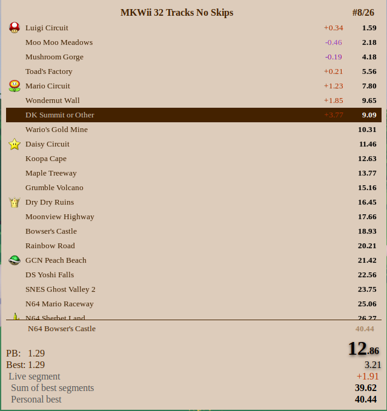
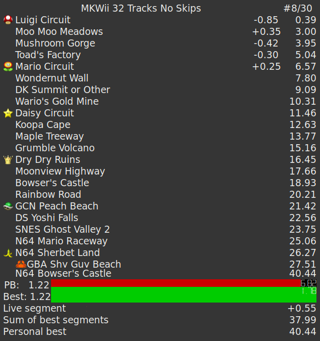
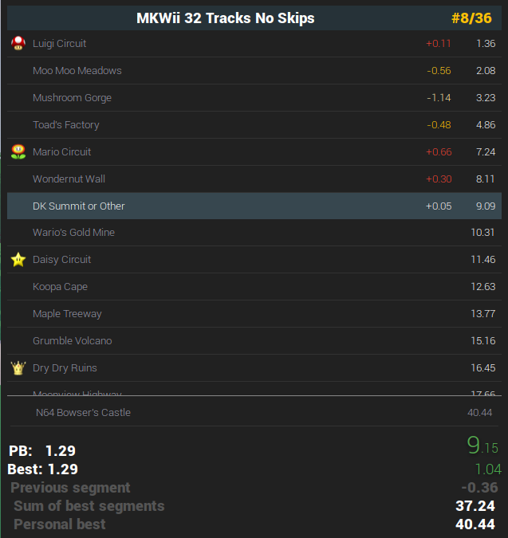
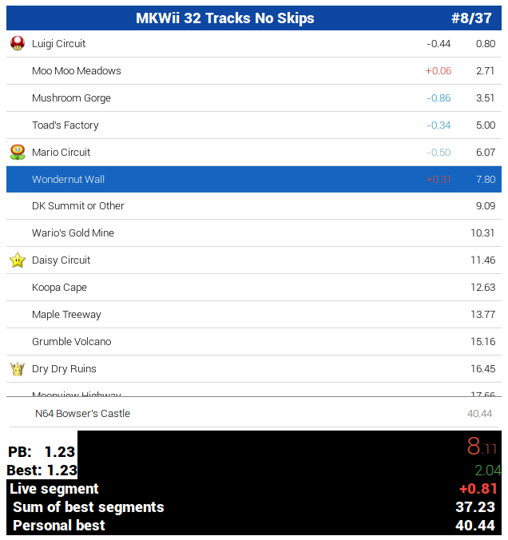
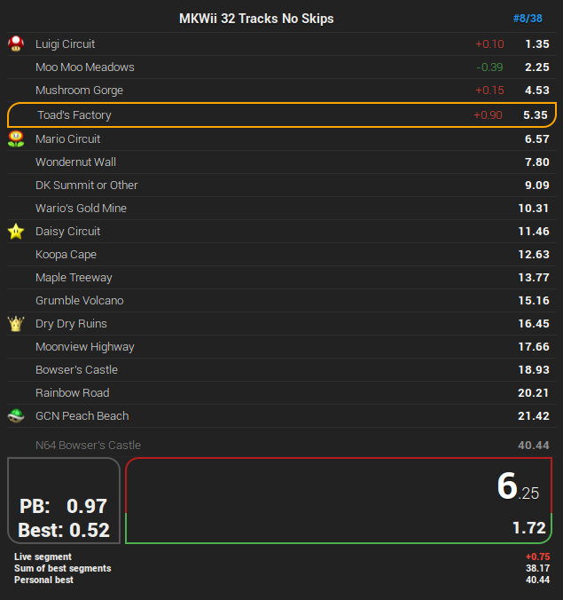
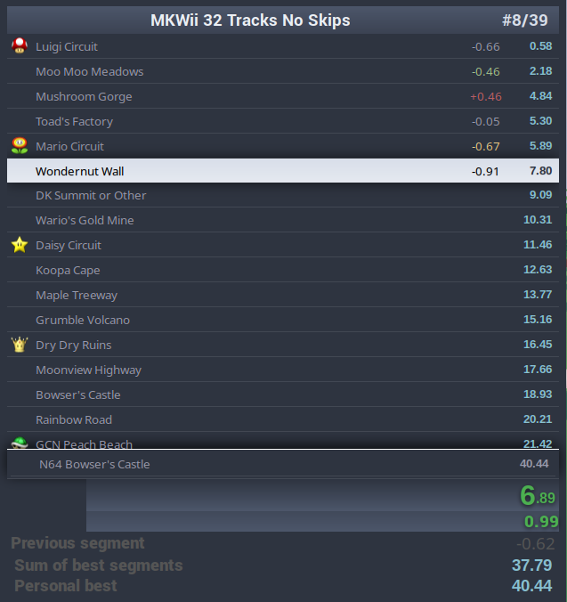
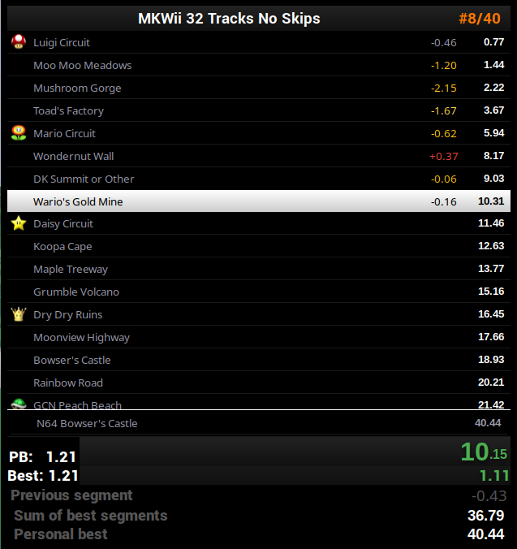
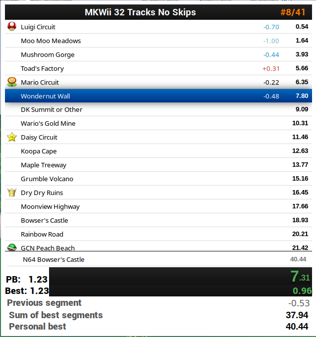
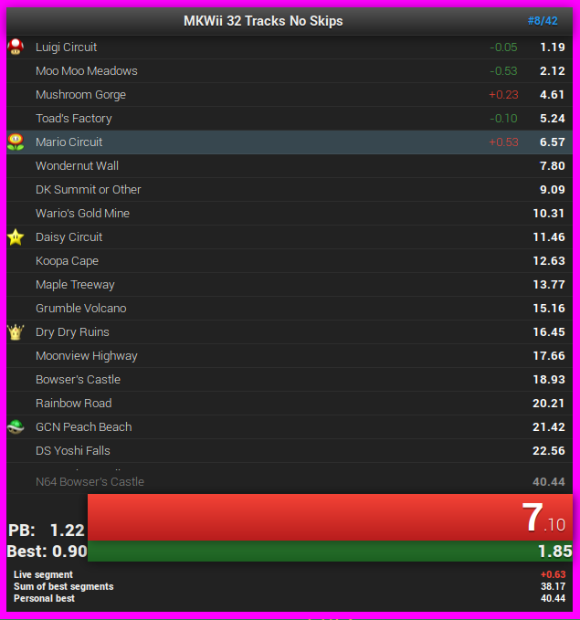

# Themes

### Book

### Digi

### Material Esque
#### Material Esque

#### Material Esque Light

### Minimalistic

### Nord

### Old Standard
#### Old Standard

#### Old Standard Light

### Standard
